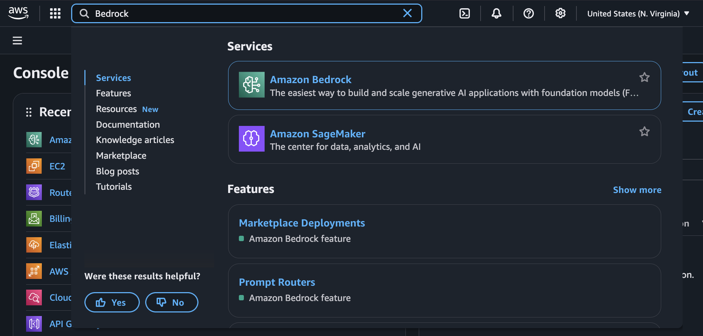
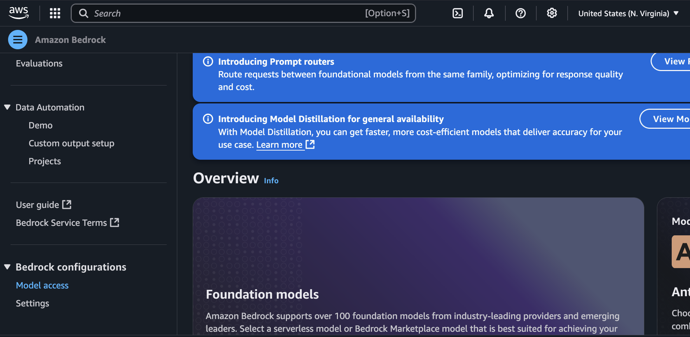
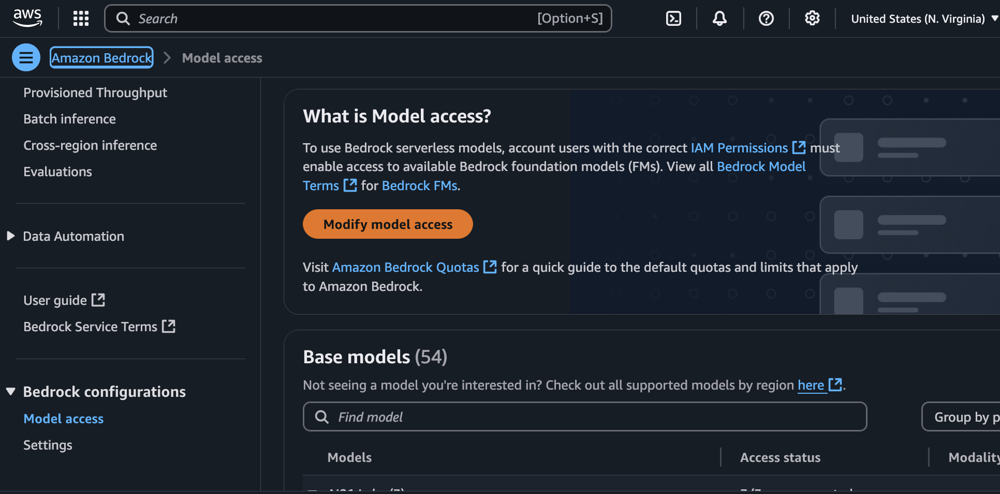
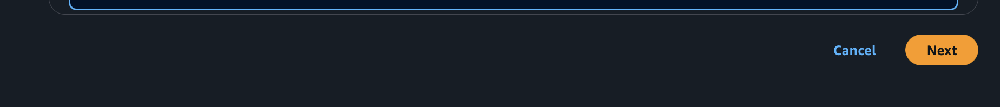

# Amazon Nova Voice Chat Agent

Demonstration of using Amazon Bedrock with Nova Sonic LLM to create a web-based voice agent.

This relies heavily on the AWS Samples demonstrating the Nova Sonic LLM and the Amazon Bedrock Agent SDK.

## Prerequisites

- BASH shell to execute deployment scripts
- An AWS account (free to sign up; this project likely will use resources beyond the Free tier)
- AWS CLI installed and configured with your credentials
- Node.js (v14 or higher) and npm installed
- Nova Sonic LLM access on Amazon Bedrock (see below on how to enable models) [link](#model-access)
- Modern web browser with WebAudio API support (**note**: Chrome seems to work right now; Firefox does not as there may be a media sampling rate mismatch on MacOS)


## Model Access

To use the Nova Sonic LLM, you need to enable access to the model in your AWS account. Follow these steps:

**1**: Login to your AWS console, search for "Bedrock" and select the service
</img>

**2**: In the Bedrock console, click on "Models" in the left sidebar (bottom of the left-nav menu)
</img>

**3**: Click on "Enable models" in the top section of the model list
</img>

**4**: In the "Enable models" dialog, select the Nova Sonic model and click "Enable"
</img>

**5**: Submit & wait for model to be enabled. This may take a few minutes.
</img>

## Building

1. Install dependencies:
```bash
npm install
```

2. Configure AWS credentials
    1. If you have AWS credentials loaded into `~/.aws/credentials`, you should be
good-to-go.  
    2. If you run this from an EC2 instance, make sure the instance has an
    IAM role assigned so that the metadata service can provide credentials.

3. Compile TypeScript code:
```bash
npm run build
```

4. Start the server:
```bash
npm start
```

5. Open your browser to the URL provided:
```bash
http://localhost:3000
```

6. Grant microphone permissions when prompted by the browser.


## Acknowledgements

Sample code is largely based on sample code provided by AWS from
[AWS Samples: Amazon Nova ](https://github.com/aws-samples/amazon-nova-samples)
under [MIT License](https://github.com/aws-samples/amazon-nova-samples/blob/main/LICENSE), specifically the `speech-to-speech/repeatable-patterns/resume-conversation` NodeJS project.
